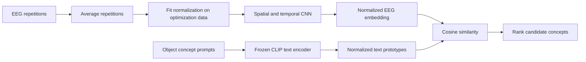

# THINGS-EEG2 → CLIP

### Decoding object concepts from EEG with a frozen semantic embedding space

[](https://colab.research.google.com/github/cengizakr/things-eeg2-clip/blob/main/notebooks/things_eeg2_clip.ipynb)
[](https://github.com/cengizakr/things-eeg2-clip/actions/workflows/checks.yml)

 Python · PyTorch · EEG · CLIP · Computational neuroscience

Can EEG responses to viewed objects be mapped into a semantic space that supports recognition of **unseen object concepts**? This research notebook explores that question using subject 1 of THINGS-EEG2 and frozen CLIP text prototypes.

A convolutional EEG encoder learns to predict normalized embeddings. At inference, cosine similarity ranks candidate concept prompts—including concepts withheld from EEG training. The output is a concept label, rather than a reconstructed image.



## What this project demonstrates

- **Cross-modal learning:** map EEG into the 512-dimensional text space of `openai/clip-vit-base-patch32`.
- **Concept-disjoint validation:** hold out 200 training concepts; fit normalization on optimization examples only and select the checkpoint by validation top-5.
- **Regularization:** dropout, weight decay, Gaussian input noise, cosine learning-rate decay and early stopping.
- **Evaluation design:** distinguish unseen-concept classification from unseen-exemplar classification of known concepts.
- **Model inspection:** text nearest neighbours, t-SNE, exploratory HDBSCAN clusters, predictions and a confusion matrix.
- **Reproducibility:** fixed seeds, cached downloads, configurable data location and saved model/metric artifacts.

## Run the notebook

**Colab:** click the badge above, select a GPU runtime, and run Sections 0–6 in order. A GPU with ample memory is recommended: the notebook keeps the repetition-averaged EEG tensors on the selected device. Initial execution downloads several GB of EEG data plus CLIP weights. Colab caches last only as long as its runtime storage persists.

**Local Python 3.10 or newer:**

```bash
git clone https://github.com/cengizakr/things-eeg2-clip.git
cd things-eeg2-clip
python -m venv .venv
source .venv/bin/activate
python -m pip install -r requirements.txt
python -m jupyter lab notebooks/things_eeg2_clip.ipynb
```

The setup cell also installs runtime dependencies into the active notebook environment. CPU execution is supported but training will be slow. Choose a PyTorch installation compatible with your GPU if running locally.

The data directory defaults to `/content/things_eeg2` on Colab and `../data` when running from `notebooks/` locally. Set `THINGS_EEG2_DATA_DIR` before launching Jupyter to use another cache location:

```bash
export THINGS_EEG2_DATA_DIR=/path/to/things-eeg2-cache
```

The notebook reads EEG from [OSF preprocessed exports (`3eayd`)](https://osf.io/3eayd/). If labels are absent from the EEG dictionaries, it retrieves `image_metadata.npy` from the [original THINGS-EEG2 image component](https://osf.io/y63gw/). Labels must match EEG row counts and train/test vocabularies must be disjoint. Dataset dictionaries are loaded with NumPy pickle support, so use the official sources or trusted local files.

OSF downloads can be rate-limited. If a download fails, wait and rerun the loading cell; completed files are reused. Data and model weights are excluded from Git.

## Experiments and outputs

| Experiment | EEG training concepts | Evaluation candidates | Purpose |
|---|---|---|---|
| Default zero-shot run | Training concepts except 200 validation concepts | Held-out test vocabulary (expected 200 concepts) | Recognize concepts unseen during EEG training |
| Optional baseline | Full training vocabulary | Training vocabulary | Inspect training fit |
| Optional exemplar run | Known concepts, with two images per concept held out | Full training vocabulary; also repeated 200-concept subsets | Generalize to new examples of known concepts |

`RUN_BASELINE`, `RUN_WITHIN_CONCEPT` and `RUN_DNN_EXPLORATION` are disabled by default. The exemplar experiment uses an independent model and normalization; it does not overwrite the selected zero-shot model. Equal candidate counts do not make the two tasks equivalent.

After the default training run, `WORK/results/` contains:

- `metrics.json`: test top-1/top-5, best validation top-5, selected epoch, subject, seed and prompt mode.
- `zero_shot_model.pt`: model weights, normalization, vocabularies, dimensions, seed and test prompts.
- `confusion_matrix.npy` and `confusion_matrix.png`: test confusion counts; indices follow the checkpoint's test vocabulary.

**Results status:** no measured decoding scores are bundled. The supplied notebook had no saved execution outputs, and full dataset training was not rerun while preparing this repository. For 200 candidates, uniform random guessing gives 0.5% top-1 and 2.5% top-5; these are reference levels, not model results. Offline checks cover notebook structure and a synthetic training/evaluation path, not scientific accuracy or live data compatibility.

## Interpretation and limitations

This is a single-subject, repetition-averaged exploration; it does not establish single-trial performance or generalization across participants. Plain prompts preserve concept IDs but may poorly represent homonyms. An optional THINGS concept table can supply sense-aware text; its coverage is printed before training.

Semantic “islands” are clusters on a t-SNE projection, sensitive to visualization and clustering choices. Same-island accuracy is a coarse diagnostic. It should be reported separately from exact concept accuracy. Changing prompts, hyperparameters or repeated experiments after observing test scores compromises the held-out interpretation.

Dependency ranges are provided rather than a fully locked environment. Seeds reduce randomness, but GPU execution may remain nondeterministic. Save the actual package versions and runtime details alongside any future reported results.

## Repository layout

```text
notebooks/things_eeg2_clip.ipynb  Main research workflow
scripts/check_notebook.py        Offline structure and syntax checks
tests/test_pipeline.py          Synthetic split, training and evaluation checks
.github/workflows/checks.yml    GitHub Actions checks (no dataset downloads)
requirements.txt                Notebook and runtime dependencies
CITATION.cff                    Project citation metadata
```

Run the offline checks with:

```bash
python scripts/check_notebook.py
python -m unittest discover -s tests -v
```

## References and acknowledgements

The EEG dataset and CLIP pretrained model are external research resources; this repository contains the decoding experiment and its presentation, not the underlying datasets or pretrained weights.

- Gifford, A. T., Dwivedi, K., Roig, G., & Cichy, R. M. (2022). [A large and rich EEG dataset for modeling human visual object recognition](https://doi.org/10.1016/j.neuroimage.2022.119754). *NeuroImage*, 264, 119754. [Official dataset and preprocessing code](https://github.com/gifale95/eeg_encoding).
- Radford, A., et al. (2021). [Learning Transferable Visual Models From Natural Language Supervision](https://arxiv.org/abs/2103.00020). [CLIP repository](https://github.com/openai/CLIP).
- Hebart, M. N., et al. (2019). [THINGS: A database of 1,854 object concepts and more than 26,000 naturalistic object images](https://doi.org/10.1371/journal.pone.0223792). [THINGS resource](https://osf.io/jum2f/).

Consult the respective resource terms for dataset and pretrained-model use.
